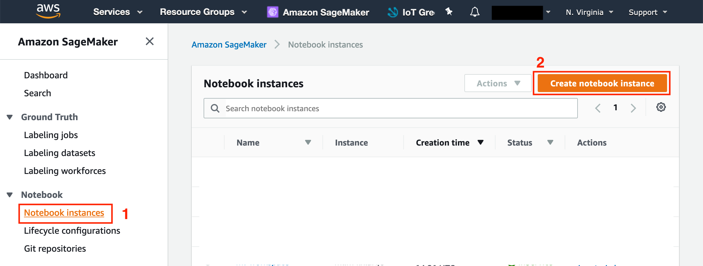
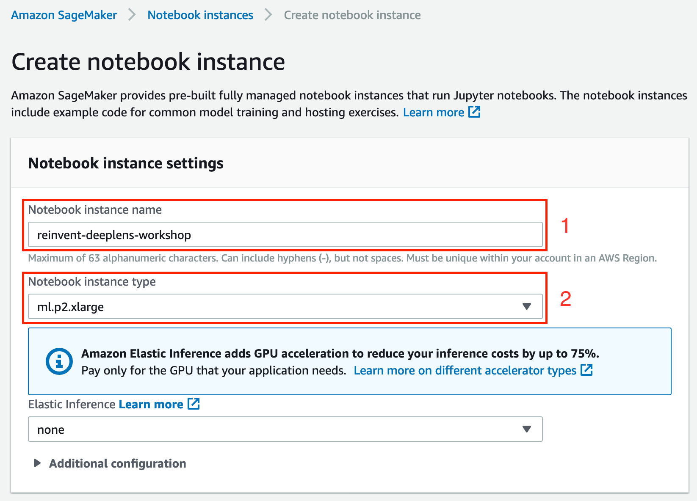
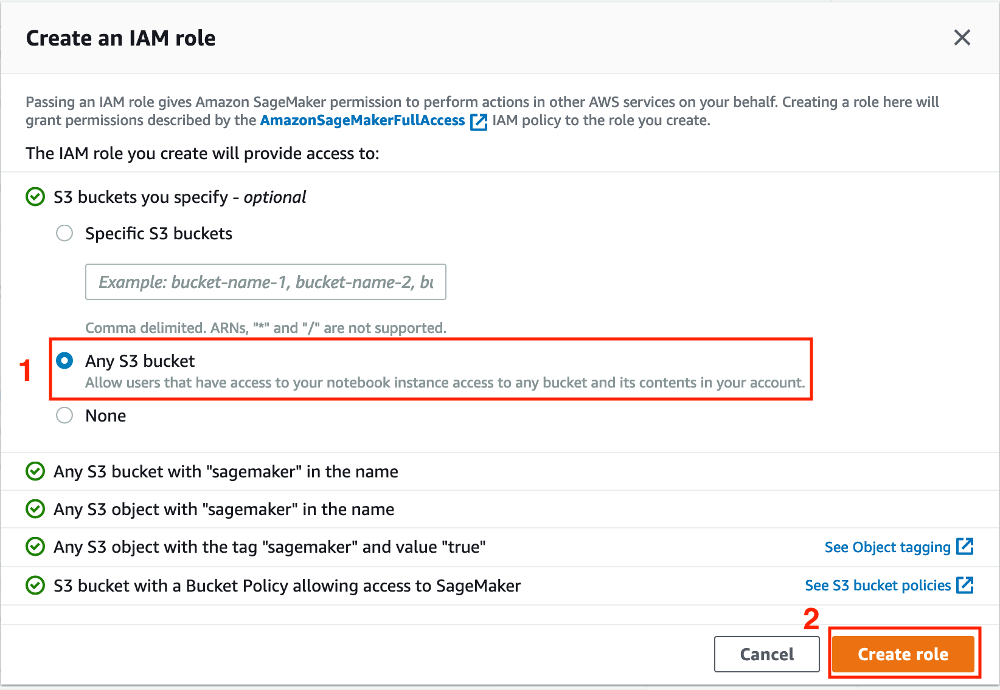
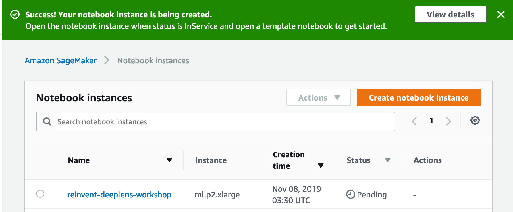
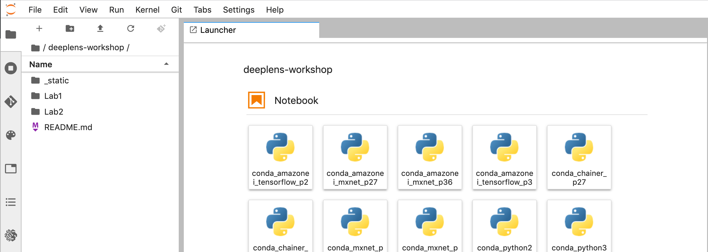

## Lab setup guide

This guides you to set up an Amazon SageMaker notebook instance which you will use for the workshop lab. Once you finish the steps below, you will get one Sagemaker noetbook instance with the lab git repository cloned so that you can start the labs.

#### Step 1. Log into Amazon SageMaker console

Click this <a href="https://console.aws.amazon.com/sagemaker/home?region=us-east-1" target="_blank">Link to Amazon SageMaker console</a>.

This will open SageMaker web console in North Virginia region. If your instructor asks to change the region, pleaes do so through the region selector shown on the upper right on your screen.


#### Step 2. Create a notebook instance

Select "Notebook instances" menu from the menu list on the left, and then click on "Create notebook instance" button.



#### Step 3. Notebok instance settings

Put your notebook name into **Notebook instance name** field. And then, choose GPU ML instance type from the **Notebook instance type** list. GPU is needed because an image classification model using MobileNet will be trained. If you cannot choose GPU for some reason, you can still do the lab but the training will be much slower. 



#### Step 4. Permission and encryption

If you have an existing IAM role, please choose the IAM role on the list.

If you use Amazon SageMaker for the first time, please create an IAM role by choosing "Create a new role" from the selection list.


On the pop-up menu, select **Any S3 bucket** to allow the notebook instance to any S3 buckets in your account. Then, click on "Create role" button on the bottom.



Then, you will see the newly created IAM role in the selection list. Please select that from the list.

We will leave the options of Root access and Encryption key for this lab.

#### Step 5. Git repositories

This step is to clone the git repository of this workshop when the notebook instance is created. If you skip this step, you can still clone any git repository using the terminal of the notebook later.

Select "Clone a public Git repository to this notebook instance only" from the Repository selection list, and the put the below Git repository URL into the **Git repository URL** field.

```
https://github.com/muhyun/deeplens-workshop
```


#### Step 6. Launch a new instance

Finally, click on "Create notebook instance" botton at the bottom to launch a notebook instance with the configuration defined. If the creation request is made successfully, you will see the screen bar on your screen. If not, please raise your hand to get help from our workshop supporter.



#### Step 7. Open your Jupyter notebook

It will take a few minutes to have your notebook instance to be **InService**. Once the status is changed to InService, then click on either **Open Jupyter** or **Open JupyterLab**.


If you see the Jupypter notebook on your screen, you are all ready to move to the lab. Congratulations!





